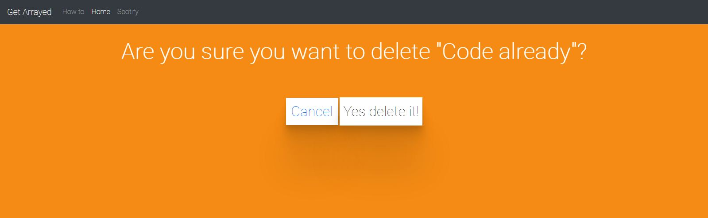
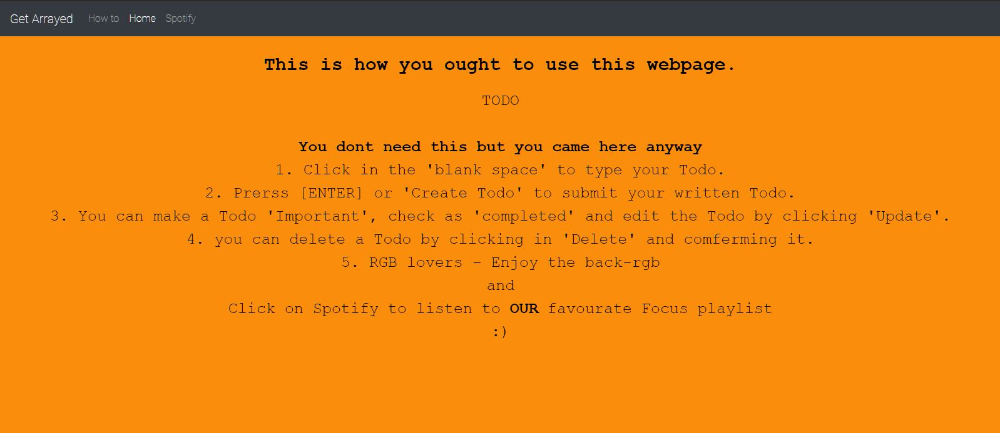

# MenAtWork-Timathon
## Get Arrayed
### This is a submission for Tech with Tim's 2nd Code Jam: Timathon.
### Topic: For students

This website is a Todo list project (which we like to call as 'Get Arrayed').

### Built using 
Language: python 3.8.2, 
WebFramework: Django 3.0. 
HTML and CSS.
Please use django 3.0!

### Running the Project
To see it for yourself make sure you are in the right directory and then type 'python manage.py runserver' in your command prompt or terminal.

#### PS: The background colors change btw!

Home page:

 
Delete page:
 
 
Update task:

Howto page:

### Authors
Contributors: Aaditya Munjal, Faneesh Munjal.
